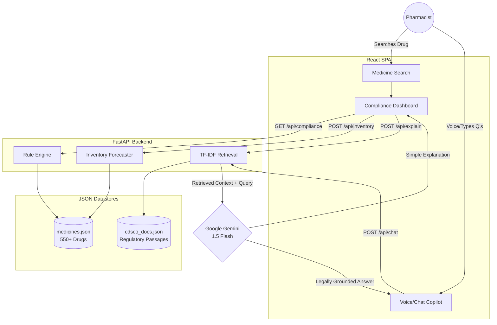

# 🧪 AI Pharmacy Assistant — RxIntelligence

> **Unstop Hackathon Submission** | AI-powered pharmacy compliance, regulatory explainability, and inventory intelligence system.

   

---

## 🎯 The Problem: Legal Risks & Inventory Blindspots

India has over 10 Lakh (1 million) retail pharmacies. Every day, chemists and pharmacists face high-stakes, real-world problems:
1. **Legal Risks & Compliance:** The CDSCO regulations (Schedule H, H1, X vs. OTC) are highly complex. Selling a Schedule H1/X drug without proper prescription logging or Form 20-F licenses can lead to severe penalties or jail time. Store owners are constantly afraid of honest mistakes.
2. **Poor Inventory Management:** Millions of rupees are lost to expired medications or stockouts of essential fast-moving drugs, directly impacting patient health and business viability.

## 💡 The Solution: RxIntelligence

**RxIntelligence** is an end-to-end AI Assistant designed to protect pharmacists legally and boost their profitability. 
It combines a deterministic rule-engine with GenAI to provide real-time, explainable decisions.

### ✨ Core Features & Differentiators

| Feature | Description |
|---|---|
| 🛡️ **Compliance Classification** | Instantly flags drugs (OTC, H, H1, X) using rule-based CDSCO mapping. |
| 💬 **Compliance Copilot (with Voice)** | **[Differentiator]** A native chat interface where pharmacists can ask natural language questions (e.g., *"Can I sell this without a prescription?"*). Features **Hindi/English Voice Input** for hands-free accessibility. |
| 📚 **RAG Regulatory Engine** | When a drug is searched or queried, the system retrieves the exact CDSCO legal text (Retrieval-Augmented Generation) and explains *why* the restriction exists using Gemini Flash. |
| 📦 **Smart Inventory Predictor** | Color-coded stock alerts, multi-tier expiry classification, and WMA+Seasonality forecasting to tell owners exactly *when* and *how much* to restock. |

---

## 🏗️ System Architecture

Our robust, production-ready stack flows seamlessly from User to AI to Data:



---

## 💼 Business Viability & Scalability

RxIntelligence is built with a **B2B SaaS model** in mind. 
It operates efficiently without requiring expensive deep learning models on the edge. By using traditional, fast algorithms (TF-IDF for retrieval, WMA for forecasting) backed by nimble external LLM calls (Gemini Flash), the system is extremely cost-effective.

**Target Market:** Small-to-medium pharmacy chains in India upgrading their legacy POS software. This tool integrates directly into existing retail flows, serving as a protective copilot right at the checkout counter.

---

## 🚀 Demo & Tech Stack

### Tech Stack
- **Frontend:** React 18, Vite, Vanilla CSS (Glassmorphism design, zero bloat)
- **Backend:** FastAPI (Python 3.9+)
- **AI/ML Base:** Custom TF-IDF Retrieval, Weighted Moving Average for sales
- **LLM:** Google Gemini 1.5 Flash API
- **Voice UI:** Native Browser `SpeechRecognition` API

### Running the Project Locally

**1. Backend:**
```bash
cd backend
python -m pip install -r requirements.txt

# Create .env and add your Gemini key
echo "GEMINI_API_KEY=your_key_here" > .env

# Start server
python -m uvicorn main:app --reload --port 8000
```
*(Windows users can simply double-click `start_backend.bat`)*

**2. Frontend:**
```bash
cd frontend
npm install
npm run dev
```
*(Windows users can simply double-click `start_frontend.bat`)*

1. Navigate to `http://localhost:5173`.
2. Search for a drug (e.g., `Doxycycline` or  `Alprazolam`).
3. Click the microphone icon in the **Compliance Copilot** and ask *"Kya main isko bina prescription bech sakta hu?"* (Can I sell this without a prescription?).
4. Review the generated response grounded in Indian regulations, alongside the inventory forecast on the left.

---
*Built for Unstop Hackathon 2026. Prioritizing impact, compliance, and usability.*
